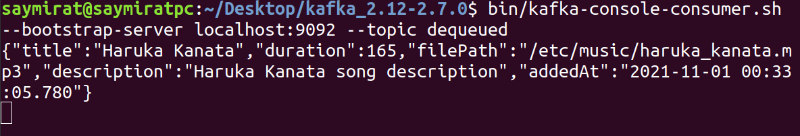

### Kafka - Oracle AQ Integration
_ _ _
An example of a basic **Kafka** - **Oracle Advanced Queuing** (AQ) adapter. 

Kafka topics used in the example:
1. **"to-be-enqueued"**

A topic where JSON strings are sent to be enqueued further

3. **"dequeued"** 

A topic where dequeued objects (converted to JSON strings) are displayed.

An order of execution:
1. JSON string is inserted into the **"to-be-enqueued"** Kafka topic
2. JSON string gets **deserialized** into a new object
3. The new object is **inserted** into Oracle queue
4. The object is **extracted** from Oracle queue
5. The extracted object is **serialized** into a JSON string
6. JSON string is sent to **"dequeued"** Kafka topic

The object type stored in Oracle queue:
```
CREATE TYPE c##user.extended_song AS OBJECT(
	title VARCHAR2(80),
	duration INTEGER,
	file_path VARCHAR2(80),
	description CLOB,
	added_at TIMESTAMP(2)
);
```

A visual representation of the execution order:

_ _ _
Source code structure:
```
src/
├─ main/
│  ├─ java/
│  │  ├─ database/
│  │  │   ├─ QueueManager.java
│  │  │   ├─ QueueSetup.java
│  │  ├─ json/
│  │  │   ├─ ClobFieldDeserializer.java
│  │  │   ├─ ClobFieldSerializer.java
│  │  │   ├─ JsonValidator.java
│  │  ├─ kafka/
│  │  │   ├─ KafkaManager.java
│  │  ├─ main/
│  │  │   ├─ Main.java
│  │  ├─ model/
│  │      ├─ ExtendedSong.java
│  ├─ resources/
│     ├─ ExtendedSongJsonScheme.json
│     ├─ jdbc.properties 
│     ├─ kafka.properties
│     ├─ log4j.properties
```
* database/**QueueManager**
    * _readJdbcProperties()_ - reading _jdbc.properties_ resource file and setting JDBC variables
    * _establishDatabaseConnection()_ - getting JDBC connection instance
    * _createAqSession()_ - creating a new AQ Session instance
    * _getConnection()_ - getter method for JDBC connection instance
    * _getAqSession()_ - getter method for AQ session instance
    * _setQueue()_ - setting Oracle queue variable 
    * _enqueue()_ - object enqueuing method 
    * _dequeue()_ - object dequeuing method
    * _queueIsEmpty()_ - checking if queue table is empty
* database/**QueueSetup**
  * _createQueue()_
  * _startQueue()_ 
  * _stopQueue()_ 
* json/**ClobFieldDeserializer** - CLOB field deserialization (JSON -> POJO)
  * _deserialize()_
* json/**ClobFieldSerializer** -  CLOB field serialization (POJO -> JSON)
  * _serialize()_
* json/**JsonValidator**
  * _validate()_ - validating JSON string for the Song object
* kafka/**KafkaManager**
  * _readKafkaProperties()_ - reading _kafka.properties_ and setting Kafka variables
  * _getConsumer()_ - returning Kafka Consumer instance
  * _getProducer()_ - returning Kafka Producer instance
  * _startStreaming()_ - starting Producer _while()_ loop
  * _startListening()_ - starting Consumer _while()_ loop
* main/**Main**
  * _main()_ - entry point of the app (invokes Enqueuer and Dequeuer threads)
* model/**ExtendedSong** - the class that represents Oracle object type (Song) by implementing SQLData interface
_ _ _
Usage:
* Run Zookeeper
* Run Kafka Server
* Edit _.properties_ files (JDBC and Kafka access credentials). Run the app (_main.Main_)
* Send a new Song as a JSON string to "**to-be-enqueued**" topic:
```
{"title":"Haruka Kanata", "duration":165, "filePath": "/etc/music/haruka_kanata.mp3", "description": "Haruka Kanata song description", "addedAt": "2021-11-01 00:33:05.777"}
```

* The string will be deserialized to POJO Song
* POJO Song will be enqueued and then dequeued:


* Dequeued POJO will be serialized and sent to "**dequeued**" topic:


_ _ _